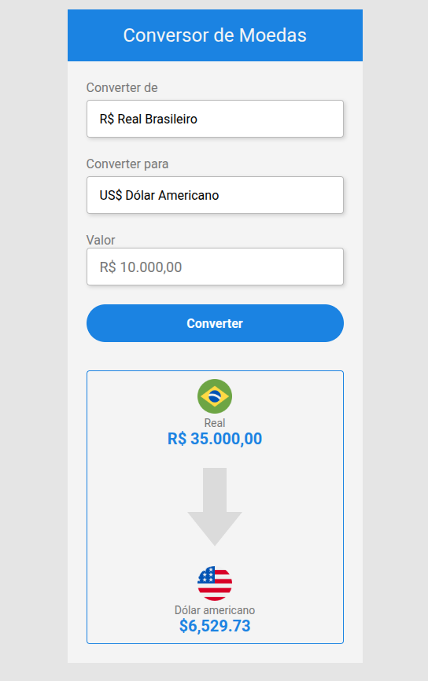

## 💵 Projeto Currency Converter
Desenvolvi esse projeto pra expandir meus conhecimentos em Javascript no Frontend, como manipulação da DOM, uso de Eventos, Formatação de valores monetários com Intl, Formatação de máscara monetária dinâmica com Regex e Consumo de api com Fetch API.

Veja o projeto no Github Pages: [Currency Converter](https://devictorbr.github.io/currency-converter/)

Valores para conversão obtidos dinamicamente com a API https://docs.awesomeapi.com.br/api-de-moedas

## 🧑🏽‍💻 Alguns Code Moments:
```javascript
const loadValues = async () => {
  const data = await fetch(
    "https://economia.awesomeapi.com.br/last/USD-BRL,EUR-BRL,BTC-BRL"
  ).then((response) => response.json());

  const dolar = data.USDBRL.high;
  const euro = data.EURBRL.high;
  const bitcoin = data.BTCBRL.high;
  return {
    dolar: dolar,
    euro: euro,
    bitcoin: bitcoin
  };
};
```
> Separei a função assíncrona para seguir a separação de responsabilidade das funções, e retornei os valores que iria utilizar em um objeto.
---
```javascript
const values = await loadValues();
  const convertedValues = {
    convertedDolar: inputMoneyValue / values.dolar,
    convertedEuro: inputMoneyValue / values.euro,
    convertedBitcoin: inputMoneyValue / values.bitcoin
  };
```
> Chamei a função pra trazer os dados necessários e os armazenei em um objeto.
---
```javascript
const formatCurrency = (convertedValues) => {
  switch (selectTo.value) {
    case "Dolar":
      toValueText.textContent = new Intl.NumberFormat("en-US", {
        style: "currency",
        currency: "USD"
      }).format(convertedValues.convertedDolar);
      break;
    case "Euro":
      toValueText.textContent = new Intl.NumberFormat("de-DE", {
        style: "currency",
        currency: "EUR"
      }).format(convertedValues.convertedEuro);
      break;
    case "Bitcoin":
      toValueText.textContent = `${convertedValues.convertedBitcoin.toFixed(
        6
      )} BTC`;
  }
};
```
> Função para formatar os valores monetários de acordo com suas respectivas origens.

## Imagem do Projeto

